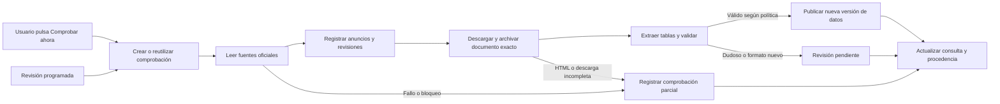

# Actualización pública de Bolsa Abierta

Diseño propuesto a partir de la auditoría del 1 de octubre de 2026. Este documento define una primera entrega revisable; la arquitectura todavía no está implementada ni desplegada.

## Resultado que debe obtener el usuario

Desde la web pública, sin instalar software, consultar la última publicación incorporada y pulsar «Comprobar ahora» para verificar las fuentes relevantes. La pantalla debe indicar qué se ha comprobado, a qué hora, qué documentos se han detectado, cuáles están incorporados y cuáles continúan pendientes.

Una comprobación reciente no garantiza que la Administración haya publicado todo ni que una plaza siga libre. La promesa del producto debe ser comprobar y explicar la evidencia disponible con rapidez, dentro de un alcance definido. Ante un fallo, se mantiene visible la copia anterior con su fecha real.

## Opciones de arquitectura

| Opción | Ventajas | Límites | Valoración |
| --- | --- | --- | --- |
| GitHub Pages con regeneración programada de instantáneas | Menor operación; lectura pública sencilla. | La actualización depende de trabajos y despliegues; el clic del usuario no ejecuta un captador en Pages. | Útil como etapa temporal, insuficiente para la experiencia pedida. |
| Frontend actual y pequeño servicio público de actualización | Consulta inmediata de la última copia y comprobación real bajo demanda; estado compartido y trazabilidad. | Requiere alojamiento de servidor y almacenamiento persistente. | Recomendado. |
| Plataforma con colas, múltiples trabajadores y varios almacenes | Escala a muchos territorios y grandes volúmenes. | Más coste y complejidad operativa. | Prematuro para este alcance. |

No se debe prometer puntualidad estricta apoyándose solo en el cron de GitHub Actions: su [documentación reconoce retrasos e incluso trabajos descartados bajo carga](https://docs.github.com/en/actions/how-tos/troubleshoot-workflows). Puede servir para pruebas y regeneraciones auxiliares.

La opción recomendada conserva el frontend. Un servicio Python es una elección razonable por las bibliotecas de PDF ya probadas en esta auditoría; no es necesario incorporar React ni reescribir las vistas para resolver la captura. El despliegue concreto queda por elegir: debe permitir peticiones HTTP de servidor, ejecución del parser y almacenamiento duradero. GitHub Pages por sí solo no proporciona esas funciones.

Para una primera instancia pequeña bastan un servicio API, un trabajador y una base de datos persistente con transacciones. SQLite puede servir con volumen duradero y un único escritor; un alojamiento efímero o varias réplicas requieren una base compartida. La decisión se tomará según el alojamiento, evitando prometer persistencia sobre el sistema temporal de una función.

## Flujo de actualización

El frontend muestra inmediatamente la última copia válida. `POST /api/refresh` inicia o reutiliza un trabajo y devuelve su identificador; no mantiene una conexión abierta esperando todo el scraping. `GET /api/refresh/{id}` devuelve progreso y resultado. Las consultas de datos leen una versión coherente y solo cambian de versión después de una publicación atómica.

Las actualizaciones simultáneas de muchos usuarios se agrupan por fuente y alcance. El servidor decide los destinos; la petición pública nunca contiene una URL libre que el captador deba visitar. Una operación administrativa separada gestiona revisiones y fuentes.

## Registro de fuentes y descubrimiento

Registrar cada fuente con organización responsable, URL, tipo de contenido, cuerpo/procedimiento cubierto, parser asociado, prioridad, historial de disponibilidad y política de comprobación. Diferenciar:

- Documento original oficial: fuente de los datos del listado.
- Anuncio oficial: evidencia de que existe una publicación y enlace para descubrirla.
- RSS oficial: señal de novedades, con cobertura limitada.
- Copia de tercero: evidencia auxiliar identificada, sin presentarla como descarga autenticada del original.

Primer alcance: anuncios y PDF de vacantes sin cubrir de Secundaria y otros cuerpos, los mismos que ya muestra la demo. La infraestructura debe poder registrar anuncios de convocatorias, incidencias, resultados y rectificaciones, pero cada familia tendrá un parser y criterios de publicación propios.

Usar el RSS accesible y el índice de RRHH como canales complementarios. El RSS respondió con diez entradas y no permite inferir ausencia de publicaciones anteriores. Revisar páginas recientes dentro de una ventana solapada propuesta de catorce días y mantener un inventario persistente de anuncios conocidos. Un documento descubierto por dos canales se descarga una sola vez por versión.

La API REST probada de WordPress devolvió 401. No se incluye como dependencia operativa. No se sortearán pantallas de verificación: se registrarán, se espaciarán los reintentos y se ofrecerá acceso a la fuente oficial o incorporación administrativa de una copia obtenida legítimamente.

## Identidad y evidencia

Separar estas entidades:

| Entidad | Información mínima |
| --- | --- |
| Fuente | Identidad, alcance, URL, autoridad y política de comprobación. |
| Intento de comprobación | Inicio/fin, resultado, fallo, recurso, código HTTP y tipo real recibido. |
| Publicación | Anuncio, identificador externo, proceso, clase documental, fecha del acto, fecha del listado y fecha del anuncio. |
| Documento | SHA-256, bytes inmutables, tamaño, MIME, URL de origen y final, fecha de descarga. |
| Ejecución de extracción | Documento, parser y versión, configuración, resultado, validaciones y errores. |
| Fila | Texto y celdas originales, campos normalizados, página, fila y coordenadas si están disponibles. |
| Revisión | Quién o qué política acepta, evidencia, fecha y motivo. |
| Versión publicada | Conjunto coherente de documentos/filas y relación con la versión anterior. |

Conservar por separado `document_issued_at`, `announcement_published_at`, `discovered_at`, `last_attempt_at`, `last_success_at`, `downloaded_at`, `extracted_at` y `accepted_at`. Usar UTC internamente y Europe/Madrid en presentación. Una importación de hoy no convierte en reciente un listado de septiembre.

La URL no identifica una revisión. Una dirección que devuelve bytes distintos crea una nueva versión; una dirección alternativa con los mismos bytes puede apuntar al mismo documento. Conservar además una huella semántica de las filas para distinguir cambios de contenido de cambios de metadatos del PDF. Una nueva huella binaria tampoco demuestra por sí sola una rectificación administrativa: la relación de sustitución debe estar sustentada.

Cada detalle ofrecerá dos enlaces distintos: «Documento utilizado» y «Página oficial». El primero debe devolver exactamente los bytes cuya huella figura en el registro. Si no se dispone de esa copia, la interfaz lo dirá en lugar de simular un archivo conservado.

## Validación antes de publicar

La aceptación automática se limita a plantillas conocidas y casos que satisfacen todas las reglas acordadas. Primero se valida el formato con un corpus etiquetado y revisado. Los casos iniciales, discrepancias, nuevas plantillas, cambios de esquema o extracción por OCR pasan a revisión administrativa. No debe exigirse al visitante revisar un PDF para que la web funcione.

Las reglas abarcan firma de archivo y MIME, límites de descarga y proceso, identificación de procedimiento, cabeceras, integridad de páginas, columnas, cantidades, códigos, campos obligatorios y correspondencia entre celdas y valores normalizados. Se preservan duplicados del original. Se detiene la publicación ante una extracción inesperadamente vacía.

La comparación independiente de extractores es una señal de consistencia, no una certificación de verdad: pueden cometer errores coincidentes. Mantener muestras visuales y pruebas con valores esperados, especialmente para tablas con celdas partidas, caracteres especiales, jornadas, duplicados y páginas de cierre.

El PDF recuperado del proceso 3133 permite empezar el corpus con una evidencia real. Los dos PDF de las copias históricas deben recuperarse si se quiere certificar su extracción. Hasta entonces su estado de procedencia seguirá indicando esa limitación.

## Frecuencia y frescura

Los siguientes valores son una propuesta inicial de operación, no una garantía medida:

| Situación | Conducta propuesta |
| --- | --- |
| Apertura de la web | Mostrar la última versión aceptada y su fecha; pedir estado de las fuentes. |
| Pulsación de Comprobar ahora | Comprobar si no hay trabajo equivalente activo; si lo hay, unirse a él. |
| Comprobación equivalente satisfactoria de hace menos de 60 segundos | Mostrar su hora y reutilizarla; permitir conocer explícitamente que se reutilizó. |
| Ventana cercana a publicaciones esperadas de un acto confirmado | Comprobar aproximadamente cada 5 minutos, sujeto a límites y comportamiento de la fuente. |
| Actividad ordinaria | Intervalo inicial de 30 minutos; espaciar fuentes sin cambios y fuera de ventanas relevantes. |
| Error temporal | Reintentos espaciados y con variación; respetar Retry-After cuando exista. |
| Verificación automatizada o error persistente | Detener reintentos agresivos, comunicar cobertura parcial y mantener la copia anterior. |

La programación puede anticipar comprobaciones, pero un calendario orientativo no determina un plazo vigente. Los actos y sus ventanas deben provenir de la convocatoria específica.

El HTTP de CARM proporcionó ETag y Last-Modified en la descarga exitosa. Se pueden aprovechar cuando funcionen, pero la prueba posterior con If-None-Match devolvió HTML de verificación. La implementación validará el contenido y no tratará ese 200 como revalidación ni marcará nueva frescura.

Medir tiempo desde descubrimiento hasta aceptación, tiempo desde pulsación hasta resultado, porcentaje de fuentes comprobadas, antigüedad desde último éxito, documentos pendientes y fallos por parser. Nunca aumentar `last_success_at` por recibir cualquier respuesta HTTP.

## Experiencia de usuario

La cabecera de cada consulta distinguirá «Listado del 30/09», «Fuentes comprobadas hace 2 minutos» y «1 documento pendiente de validación». Estos mensajes son ejemplos del diseño, no el estado actual de la demo.

El clic mostrará pasos comprensibles: buscando publicaciones, descargando, validando y resultado. Los resultados posibles serán sin novedades detectadas dentro del alcance, nueva copia incorporada, novedad pendiente de validación o comprobación incompleta. Si una fuente falla, la web no podrá afirmar que todo está actualizado.

Al cambiar de copia se mantendrán únicamente filtros representables en esa copia o se mostrará qué filtro dejó de existir. Los favoritos se agruparán por documento. Los CSV incluirán procedencia y fecha. La navegación devolverá el foco al título o al contenido correspondiente y los botones de filtro expresarán su estado a tecnologías de asistencia.

## Seguridad y operación

Permitir únicamente destinos oficiales configurados; comprobar también cada redirección y resolución para impedir acceso a redes internas. Limitar bytes, páginas, tiempo y memoria del parser. Validar JSON y tipos antes de renderizar. Centralizar URLs seguras y servir PDFs archivados desde un origen controlado.

El refresco público tendrá límites por cliente y límites globales por fuente. Las funciones de aprobación, cambio de fuentes y subida manual serán administrativas. No se necesitan cuentas de visitantes ni credenciales Educarm. Las preferencias actuales pueden seguir en el navegador.

Archivar documentos y base de datos con copias de seguridad y una prueba de restauración. Mantener eventos técnicos sin almacenar innecesariamente búsquedas o identidades de usuarios. Monitorizar recursos fallidos, cola acumulada y antigüedad de la última actualización aceptada.

## Criterios de aceptación de la primera entrega

1. Un documento nuevo detectado desde una fuente permitida llega a una versión consultable, con huella y copia exacta disponibles.
2. Un PDF con nueva revisión en la misma URL no queda oculto por una copia anterior.
3. HTML de verificación con HTTP 200, timeout, PDF truncado y cero tablas inesperadas no borran ni sustituyen datos válidos.
4. Los límites de tabla, duplicados, cantidades y páginas se verifican con casos reales y expectativas explícitas.
5. La publicación de datos es atómica y repetible: reintentar no duplica filas ni eventos administrativos.
6. Veinte peticiones simultáneas de actualización comparten el trabajo por fuente; no provocan veinte capturas iguales.
7. Una captura parcial muestra los fallos y conserva la fecha del último éxito real.
8. El documento descargable coincide con su SHA-256 y cada fila enlaza a la página de la copia utilizada.
9. Los filtros y favoritos superan las reproducciones de los fallos confirmados; los controles funcionan en escritorio, móvil y teclado.
10. El alojamiento público ejecuta la captura y conserva datos tras reiniciar; no requiere instalaciones en el ordenador del visitante.

## Secuencia de entrega

Primera fase: fuentes legibles en Git, pruebas de los fallos confirmados, correcciones de interfaz y metadatos honestos. Segunda: archivo de documentos, captador acotado y parser con corpus. Tercera: API y actualización a petición con publicación atómica. Cuarta: despliegue público, observabilidad y prueba de restauración. Después se amplía cobertura por familias documentales.

Antes de elegir el alojamiento deben conocerse presupuesto, cuenta disponible y quién administrará el servicio. No se han contratado servicios ni cambiado la demo durante esta auditoría. El diseño evita depender de un proveedor concreto hasta resolver esa decisión.
